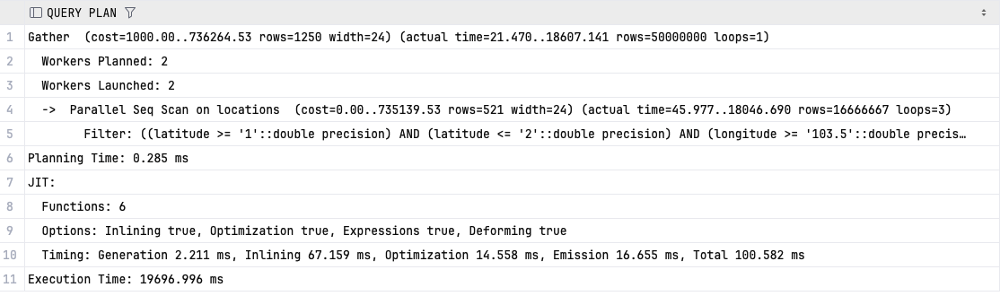
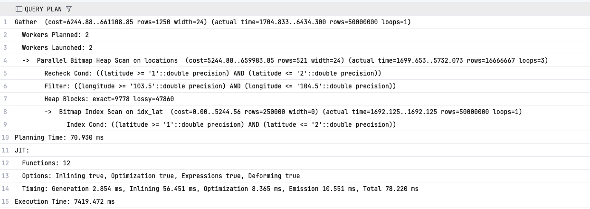
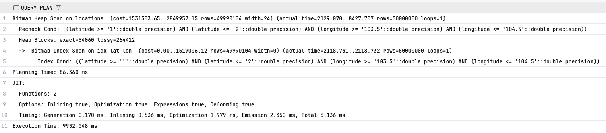

# Persons Finder

## Run with H2 (default)

```bash
./gradlew bootRun
```

## Run with PostgreSQL

Start PostgreSQL using Docker Compose:
```bash
docker-compose -f docker-complose.yml up -d
```

```bash
./gradlew bootRun --args='--spring.profiles.active=postgres'
```

## Run Tests

```bash
./gradlew test
```

# Performance Notes

Start PostgreSQL using Docker Compose:
```bash
docker-compose -f docker-complose.yml up -d
```
50M persons and locations:
```bash
```sql
INSERT INTO persons (id, name)
SELECT i, 'Person_' || i FROM generate_series(1, 50000000) AS s(i);

INSERT INTO locations (id, latitude, longitude)
SELECT i,
       1.0 + random() * 1.0,      -- latitude near Singapore
       103.5 + random() * 1.0     -- longitude near Singapore
FROM generate_series(1, 50000000) AS s(i);
```
```sql
CREATE INDEX idx_lat ON locations(latitude);
CREATE INDEX idx_lat_lon ON locations(latitude, longitude);
```

## Performance Testing Summary
- At 10 million records, PostgreSQL consistently chose a Sequential Scan, even when basic B-tree indexes were available.
- A single-column index on latitude performed better than a composite (latitude, longitude) index — the latter was often ignored or less efficient.
- First meaningful performance gains appeared at around 50 million records

```sql
EXPLAIN ANALYZE
SELECT *
FROM locations
WHERE latitude BETWEEN 1.0 AND 2.0
  AND longitude BETWEEN 103.5 AND 104.5;
```





